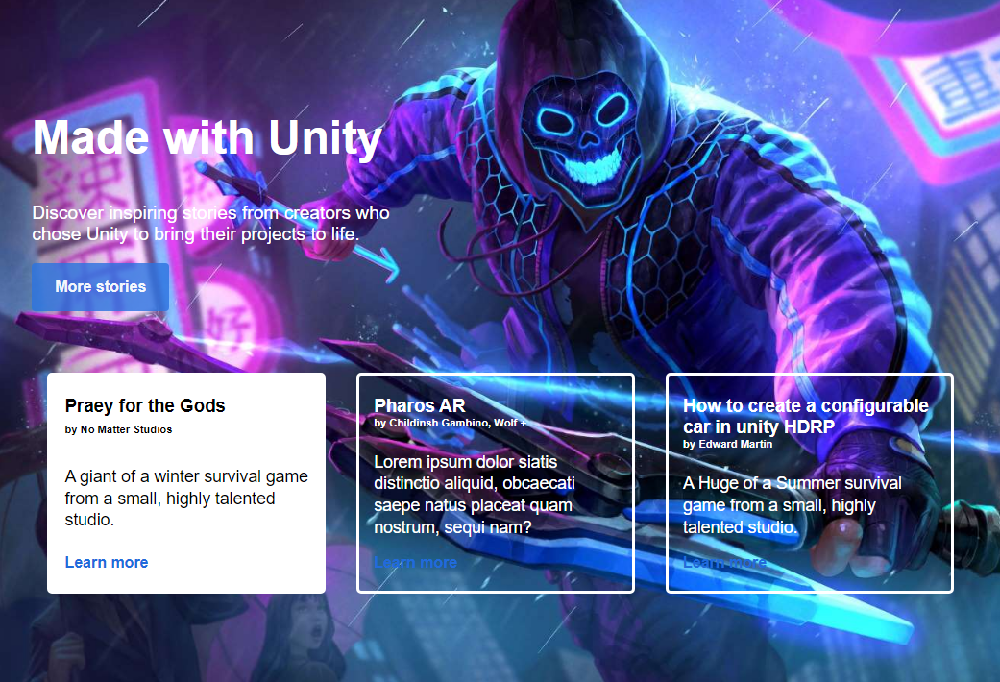
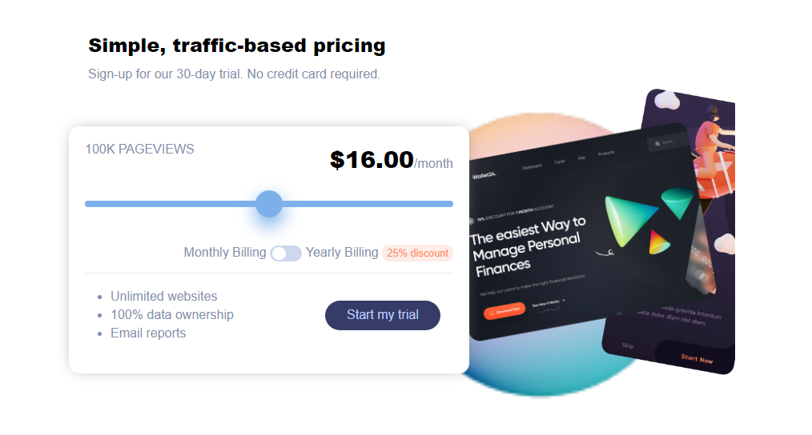

# Website inspired by Unity Website

## Overview
 This WebSite has some cool features like tabs functionality, working
 pricing component and awesome design.

 
### Screenshots

  

  

  

   

### Links

- Live Site URL: [See Website](https://pro-site-1.netlify.app)

## My process

### Built with

- HTML5 
- CSS custom properties
- Flexbox
- CSS Grid
- Desktop first workflow
- @media queries

### What I learned
- How to make tab functionality.
- How to make working pricing component with JavaScript

## Author

- Website - [Sagar Sharma](https://sagar-io.github.io/)
